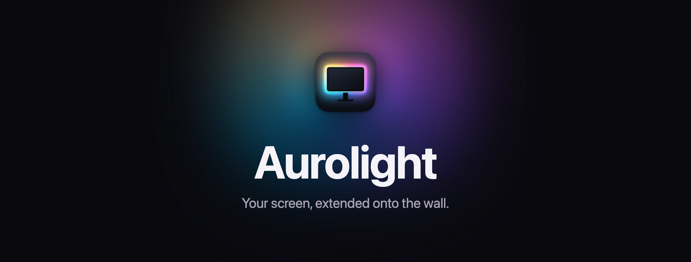
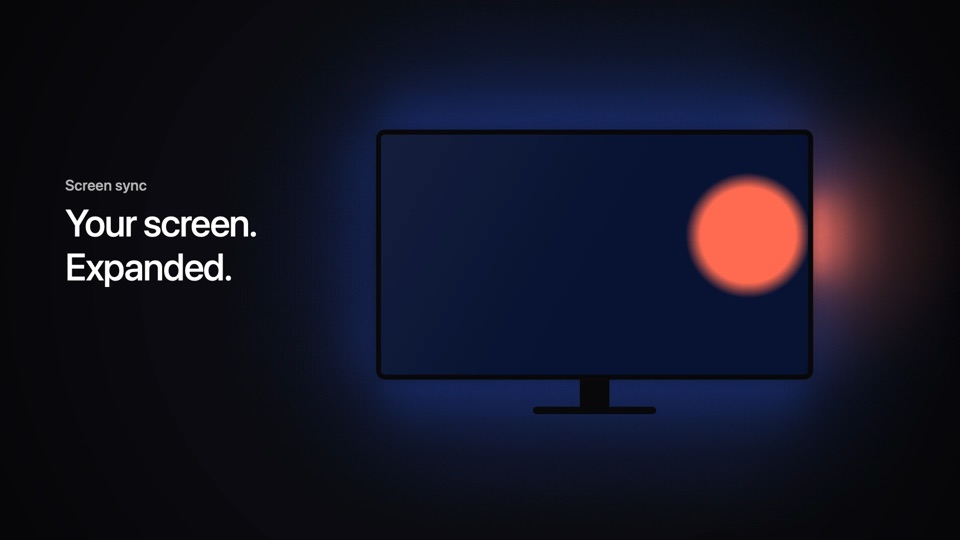
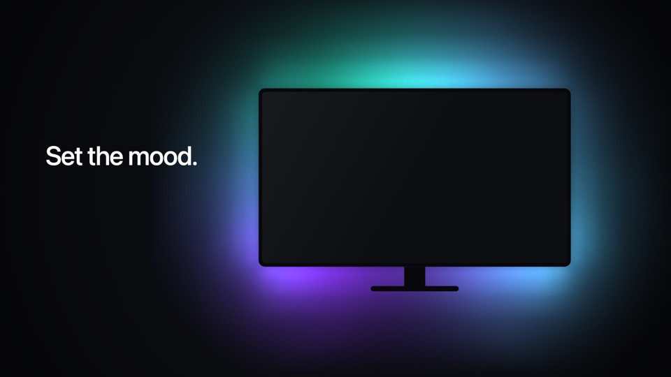
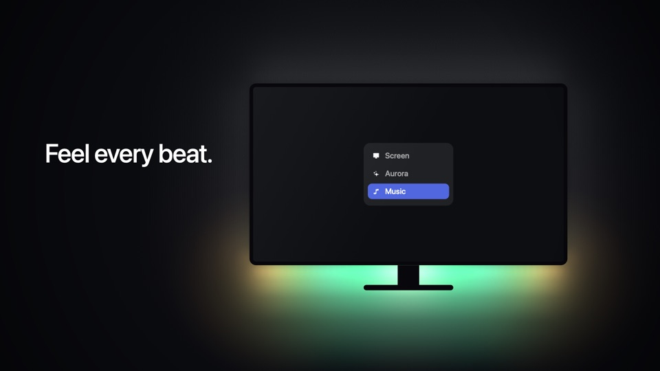
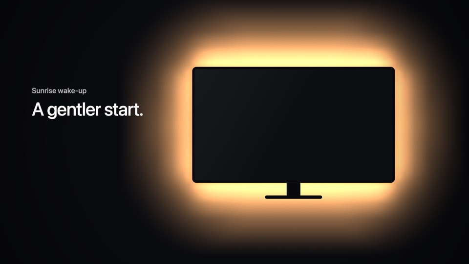
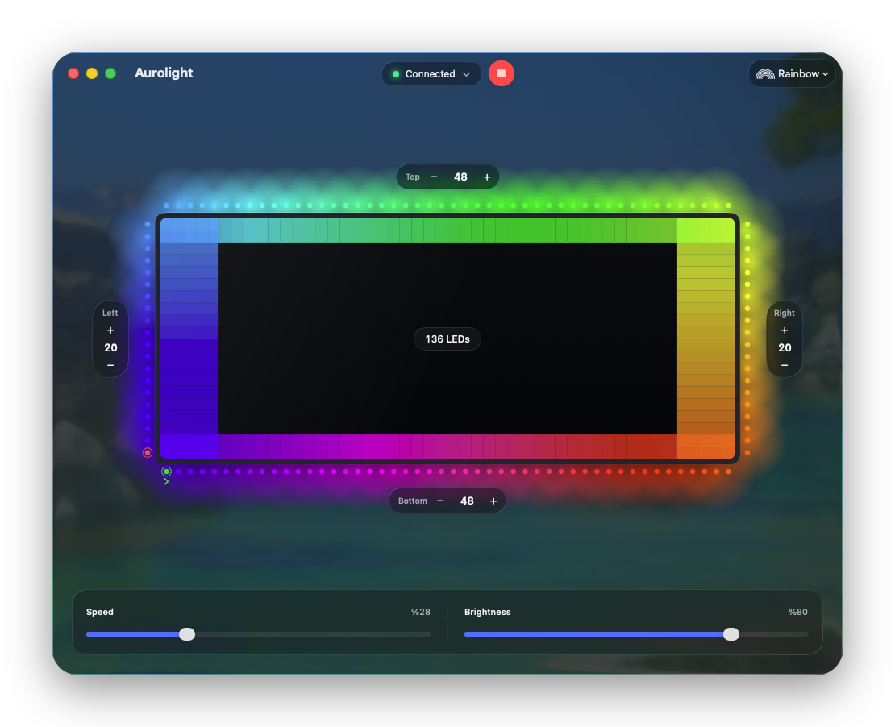
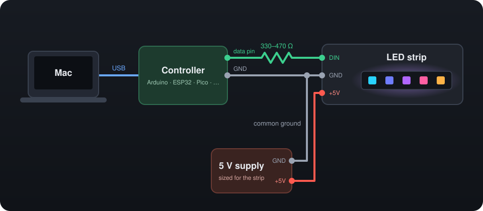

<p align="center">
  
</p>

# Aurolight

Aurolight drives an addressable LED strip behind your monitor from your Mac: it extends the screen onto the wall,
runs ambient effects, moves with your music and fades the room in or out with a sunrise or sunset.

<table>
  <tr>
    <td width="50%"><br><b>Screen sync</b> — the edges of your screen, painted onto the wall.</td>
    <td width="50%"><br><b>Effects</b> — aurora, fire, ocean, candle, comet and more.</td>
  </tr>
  <tr>
    <td width="50%"><br><b>Music</b> — bass, mids and treble flow around the screen.</td>
    <td width="50%"><br><b>Sunrise</b> — a slow dawn that fills the room.</td>
  </tr>
</table>

<p align="center">
  
</p>

## Requirements

- macOS 26 or later
- An addressable RGB LED strip (WS2812B, SK6812 RGB, …) with its own 5 V supply
- A USB controller: Arduino, ESP32, ESP8266, Raspberry Pi Pico or Teensy ([supported boards](firmware/README.md))
- To build: Xcode 26 and [PlatformIO](https://platformio.org)

## Wiring

<p align="center">
  
</p>

Pins for each board and the wiring precautions are in [firmware/README.md](firmware/README.md#wiring).

## Getting started

Download the latest `Aurolight-<version>.dmg` from [Releases](https://github.com/0x178F/aurolight/releases) and
drag Aurolight to Applications. The app isn't notarized: the first time macOS blocks it, choose **Open Anyway** in
System Settings › Privacy & Security.

To flash the controller or build the app yourself:

```bash
brew install platformio
git clone https://github.com/0x178F/aurolight.git && cd aurolight

make flash BOARD=nano           # flash the controller; see firmware/README.md for other boards
make run                        # build and open Aurolight
```

The first launch walks you through the Screen Recording permission, the controller and the LED layout.

The Screen Recording permission is tied to the app's signature, so an ad-hoc signed build asks for it again after
a rebuild. To keep it, create a Code Signing certificate in Keychain Access and put its name in
`scripts/.signing-identity`.

## Using Aurolight

- Pick a mode (Screen, an effect, Music, Sunrise…) in the toolbar and press ▶.
- Set the number of LEDs on each edge around the preview. The green dot is the first LED: drag it to where the
  cable enters the strip, and use ⇄ to flip the direction.
- In Screen mode, **Immersion** lets bright things in the middle of the screen light the strip too.
- With a controller connected, setup ends by matching the strip's white to your screen's. To do it again, click the
  status in the toolbar and choose **Calibrate White…**.
- Closing the window keeps Aurolight running in the menu bar.

## Troubleshooting

- **Upload fails:** quit Aurolight first; only one app can use the serial port.
- **Nothing lights up:** check the common ground and the data pin, and that the strip has its own power.
- **Colors are in the wrong place:** move the green dot or flip the direction. Red and green swapped: change
  `COLOR_ORDER` in the firmware.
- **The controller disconnects now and then:** plug it straight into the Mac rather than through a hub.

## Development

```
core/       AurolightCore: detection, color, effects and the LED protocol; platform-independent
macos/      The macOS app: UI, screen capture, audio and serial ports
firmware/   Controller firmware (PlatformIO)
```

`core/` has no platform dependencies, so a port to another platform, such as Android TV, reuses it and brings its
own capture, output and UI.

| Command | Description |
|---------|-------------|
| `make run` | Build and open the app |
| `make release` | Build the universal disk image in `build/` |
| `make test` | Run the core and app tests |
| `make benchmark` | Measure black-bar, video-window and overlay detection on synthetic scenes |
| `make benchmark-footage` | The same on real movies (needs ffmpeg; downloads ~480 MB once) |
| `make format` | Format the Swift and firmware code |
| `make lint` | SwiftLint, ShellCheck and Periphery |
| `make hooks` | Check formatting, lint and the commit message on every commit |
| `make flash BOARD=…` | Flash the firmware ([boards](firmware/README.md#supported-boards)) |
| `make firmware` | Build the firmware for every board |

## Contributing

See [CONTRIBUTING.md](CONTRIBUTING.md).

## License

[MIT](LICENSE)
